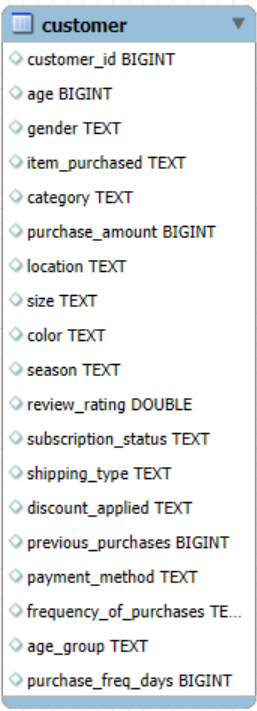
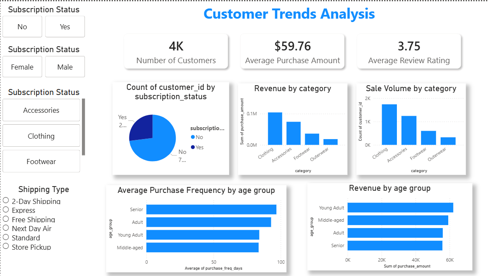

# 📊 E-commerce Customer Trends Analysis

## 📌 Project Overview
This project focuses on analyzing **customer behavior and sales trends** for an e-commerce platform using **SQL, Python and Power BI**. The goal is to uncover actionable insights related to customer demographics, product performance, subscription behavior, and purchasing patterns to support data-driven business decisions.

An interactive dashboard was developed to visualize key performance indicators (KPIs) and enable stakeholders to explore data dynamically through filters and slicers.

---

## 🎯 Objectives
- Analyze customer purchasing behavior across different demographics
- Identify top-performing product categories by revenue and sales volume
- Understand the impact of subscription status on customer count
- Evaluate purchase frequency and revenue contribution by age group
- Build an interactive dashboard for easy exploration of insights

---

## 🧰 Tools & Technologies Used
- **Python (Pandas, NumPy)** – Data cleaning, preprocessing, and transformation
- **SQL** – Data extraction, joins, aggregation, and analysis
- **Power BI** – Data modeling, DAX calculations, interactive dashboard creation
- **Excel** – Initial data inspection and formatting

---

## 📂 Dataset Description
The dataset contains customer-level transaction data from an e-commerce platform. Raw data was first **cleaned and preprocessed using Python** before being analyzed in SQL and visualized in Power BI.

Key fields include:
- Customer ID
- Age group
- Gender
- Subscription status
- Product category (Clothing, Accessories, Footwear, Outerwear)
- Purchase amount
- Purchase frequency
- Review ratings
- Shipping type

---

## 📈 Key Metrics (KPIs)
- **Total Customers:** 3K+
- **Average Purchase Amount:** $59.76
- **Average Review Rating:** 3.75
- **Revenue by Category**
- **Sales Volume by Category**
- **Purchase Frequency by Age Group**
- **Revenue Contribution by Age Group**

---

## 🔄 Data Cleaning & Preprocessing (Python)
- Handled missing and inconsistent values in customer and transaction data
- Standardized categorical fields such as age group, gender, and product category
- Removed duplicates and validated data types
- Created derived columns for improved analysis (e.g., purchase frequency buckets)
- Prepared clean, analysis-ready datasets for SQL querying and Power BI visualization

---

## 📊 Dashboard Features

- Interactive KPI cards for quick business overview
- Category-wise revenue and sales volume analysis
- Subscription status distribution (Subscribed vs Non-Subscribed)
- Age-group based purchase frequency and revenue analysis
- Dynamic slicers and filters for:
  - Subscription status
  - Gender
  - Product category
  - Shipping type

---

## 🔍 Key Insights
- **Non-subscribed customers form the majority**, indicating opportunities for subscription growth
- **Clothing** is the highest revenue and sales volume generating category
- **Young Adults** contribute the highest overall revenue
- **Senior customers** show the highest purchase frequency
- Accessories and Footwear show potential for targeted promotions

---

